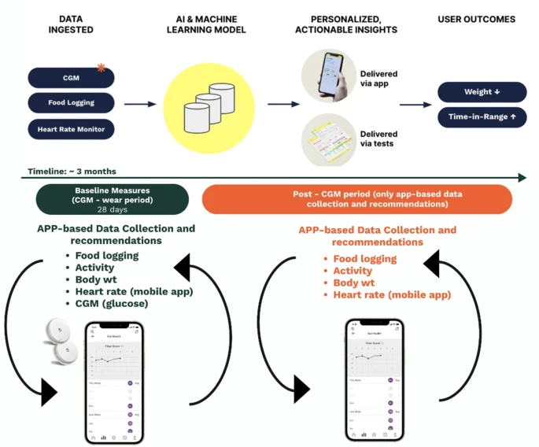
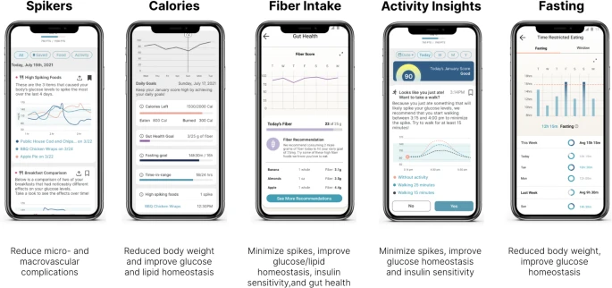

# Digital health application integrating wearable data and behavioral patterns improves metabolic health
https://www.nature.com/articles/s41746-023-00956-y  
Ashkan Dehghani Zahedani, Tracey McLaughlin, npj Digital Health, 2023

## Introduction

이 논문은 37.3백만 미국 성인이 당뇨병을 앓고 있으며 그 중 95%가 제2형 당뇨병(T2D)이라는 사실에서 시작합니다. 미국에서 당뇨병 예방 프로그램이 효과적임이 입증되었지만, 이러한 프로그램은 자원 집약적이고 일부 인구에게 접근하기 어렵습니다. 이를 해결하기 위해, 저자들은 연속적인 포도당 모니터링(CGM)과 웨어러블 기술을 통합하여 맞춤형 생활 습관 권장 사항을 제공하는 원격 프로그램을 개발했습니다.

이 프로그램은 2,217명의 참가자를 대상으로 28일 동안 CGM을 사용하여 포도당 패턴을 기록하고, 식단, 신체 활동, 체중을 스마트폰 앱을 통해 기록하게 했습니다. 앱은 참가자들에게 매일 통찰과 맞춤형 권장 사항을 제공했습니다. 결과적으로 비당뇨병 참가자에서 고혈당증, 포도당 변동성 및 저혈당증이 유의미하게 개선되었으며, 모든 그룹에서 체중 감소와 건강한 식습관의 증진이 관찰되었습니다.

음식 및 활동 선택과 관련된 정보가 혈당 반응과 연결되고 결합된 데이터로부터 학습할 수 있는 사용자와 공유된다면 행동 수정 도구로서의 CGM의 이점은 확대될 것입니다. 여러 건강 지표를 동시에 지속적으로 추적하는 웨어러블 장치와 웨어러블 장치의 데이터를 통합할 수 있는 모바일 앱을 포함한 현재의 기술은 당뇨병 치료 및 예방에 대한 행동 접근 방식에 혁명을 일으킬 가능성이 있습니다. 라이프스타일 관리에 대한 현재의 접근 방식은 성공적인 것으로 입증되었지만 영양소와 활동에 다르게 반응할 수 있는 개인에 맞춘 것은 아닙니다. 실제로 여러 연구에서 동일한 음식에 노출된 후 개인 간의 혈당 반응이 다르다는 것을 보여주었는데, 이는 마이크로바이옴, 유전학 및 인슐린 저항성 및 베타 세포 기능과 같은 기본 생리학과 같은 다양한 개인 간 생물학적 차이를 반영할 수 있습니다. 식단과 신체 활동에 대한 집착도 개인 선호도와 환경 요인의 차이로 인해 개인마다 다릅니다.

여기서, 우리는 수백만 개의 CGM 및 기타 건강 데이터 포인트를 사용하여 사용자의 개인 데이터 패턴을 기반으로 개별화된 피드백과 맞춤형 권장 사항을 제공하는 새로운 디지털 기술 기반 프로그램이 생활 방식 선택과 대사 건강을 개선할 수 있는지 확인하려고 했습니다. 우리는 이 접근 방식이 더 건강한 식습관과 신체 활동을 포함하고 개인화된 혈당 반응과 선호도를 고려한 행동 수정을 유도함으로써 체중 감소를 촉진하고 신체 활동을 증가시키며 T2D 치료 및 예방에 중요한 고혈당증을 감소시킬 것이라고 가정했습니다.

## Results

### 데이터 수집 및 참가자
- **참가자**: 2,217명의 참가자가 프로그램에 참여하였으며, 이 중 1,066명은 CGM 데이터가 충분히 수집되었고, 일관된 식사 기록 및 체중 추적을 진행했습니다.
- **분석 조건**: CGM 데이터, 식사 기록, 체중 데이터가 일정 기준을 충족한 참가자들만 분석에 포함되었습니다.

참가자들은 모바일 애플리케이션("January AI app")을 사용했고, 28일 동안 CGM(Freestyle Libre, Abbott)과 HR 모니터(Apple Watch 또는 Fitbit)를 착용했습니다.
  

January AI app은 CGM 및 HR 데이터를 사용자가 입력한 식단 및 활동 데이터와 통합했습니다. 앱은 라이프스타일 선택이 포도당 패턴에 어떤 영향을 미쳤는지 알 수 있도록 통합 응답 데이터를 사용자에게 다시 제공하는 것 외에도 AI 기반 개별화된 권장 사항을 제공했습니다.
  
### 혈당 조절 개선
- **Baseline Time in Range (TIR)**: 참가자들은 초기 TIR이 높은 편이었으며, T2D 참가자는 82%, 정상 혈당 및 당뇨 전 단계 참가자는 91%를 기록했습니다.
- **TIR 향상**: 초기 TIR이 90% 미만인 참가자들(비정상 조절)은 T2D 참가자의 경우 9.8%, 정상 및 당뇨 전 단계 참가자는 각각 6.2% 및 9.6% 증가했습니다.
- **GMI 감소**: GMI가 높은 참가자들은 유의미한 GMI 감소를 보였으며, 이는 당화혈색소(HbA1c) 수준의 개선을 반영합니다.

### 체중 감소
- **체중 변화**: 28일 동안 참가자들의 체중이 유의미하게 감소했으며, T2D 참가자들은 평균 4.4 파운드를, 당뇨 전 단계 및 정상 참가자들은 각각 평균 2.5 파운드를 감량했습니다.
- **고도비만 참가자**: 초기 체중이 높은 참가자들은 더 많은 체중 감소를 기록했으며, 예를 들어, 초기 체중이 250-300 파운드인 참가자들은 12주 동안 평균 18.9 파운드를 감량했습니다.

### 신체 활동 증가
- **신체 활동 기록**: 연구 기간 동안 신체 활동이 증가했으며, 특히 정상 및 당뇨 전 단계 참가자들은 신체 활동 시간이 두 배로 증가했습니다.
- **객관적 활동 측정**: 심박수 데이터 분석 결과, 활동 강도가 증가했음을 확인했습니다.

### 영양 섭취 변화
- **식사 기록**: 참가자들은 칼로리 섭취를 줄이고, 탄수화물 및 설탕 섭취를 감소시키며, 단백질, 건강한 지방 및 섬유질 섭취를 증가시켰습니다.
- **개인화된 권장 사항**: 앱을 통한 맞춤형 식사 권장 사항이 이러한 변화를 이끌었습니다.

### 결론
이 연구는 CGM과 웨어러블 데이터, 행동 패턴을 통합한 디지털 건강 애플리케이션이 참가자들의 대사 건강을 향상시킬 수 있음을 보여줍니다. 특히 당뇨병 예방과 치료에 있어서 맞춤형 생활 습관 권장 사항이 효과적임을 시사합니다.

## Discussion

### 1. **연구 성과**:
   - 이 연구는 연속 포도당 모니터링(CGM)과 디지털 건강 애플리케이션을 결합하여 대규모 참가자 집단에서 생활 습관 변화를 유도하고 혈당 관리를 개선할 수 있음을 보여주었습니다.
   - 당뇨병 전 단계 및 초기 당뇨병 단계의 참가자에서 식이 습관 변화와 신체 활동 증가를 통해 혈당 조절이 향상되었습니다.

### 2. **기술의 중요성**:
   - 새로운 기술이 포도당 반응을 개인화하여 사용자에게 피드백을 제공함으로써 식품 선택과 활동 패턴을 개선할 수 있습니다.
   - 이 기술은 인간 코칭 없이도 효과적인 생활 습관 개입을 가능하게 하여, 비용 효율적이며 대규모로 확장 가능한 솔루션을 제공합니다.

### 3. **기존 연구와의 비교**:
   - 기존 연구들은 CGM을 사용한 생활 습관 변화에 대해 소규모로 연구되었으나, 이 연구는 대규모로 진행되어 더 신뢰성 있는 데이터를 제공했습니다.
   - 기존의 당뇨병 예방 프로그램(DPP)은 효과적이지만 자원 집약적이고 접근성이 떨어지는 반면, 디지털 기술을 활용한 접근 방식은 이러한 한계를 극복할 수 있습니다.

### 4. **개인화의 필요성**:
   - 식이 및 신체 활동에 대한 반응은 개인마다 다르기 때문에, 맞춤형 권장 사항이 중요합니다.
   - 이 연구는 개인의 포도당 반응과 선호도를 반영한 맞춤형 권장 사항이 혈당 조절과 체중 감소에 효과적임을 확인했습니다.

### 5. **한계 및 향후 연구**:
   - 이 연구는 대조군이 없다는 점, 자가 보고된 데이터의 정확성 문제, 짧은 연구 기간 등의 한계가 있습니다.
   - 장기적인 효과를 평가하기 위해서는 더 긴 기간 동안의 연구가 필요합니다.
   - 다양한 인구 집단에 대한 맞춤형 접근 방식을 개발하고 평가할 필요가 있습니다.

### 6. **실용적 의미**:
   - 이 접근 방식은 의료 접근성이 낮은 사람들에게도 효과적일 수 있으며, 특히 원격지에 거주하는 사람들에게 유용할 수 있습니다.
   - 기술 기반의 접근 방식이 전통적인 모델보다 더 많은 사람들에게 더 나은 건강 결과를 제공할 수 있음을 시사합니다.
