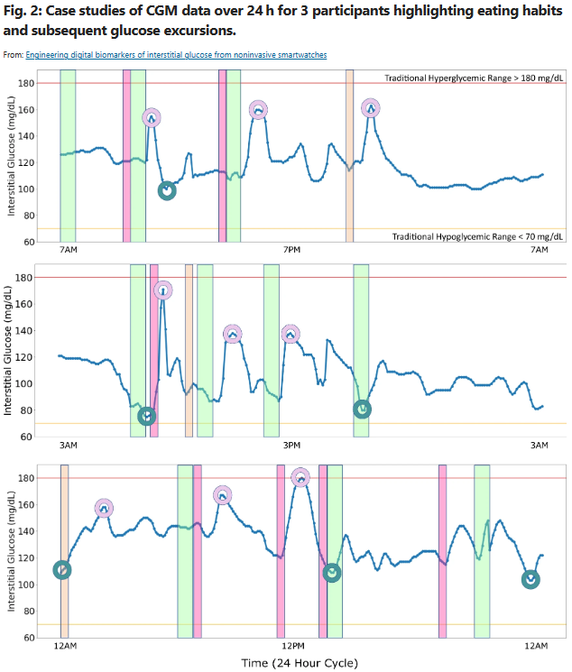

# Engineering digital biomarkers of interstitial glucose from noninvasive smartwatches
https://www.nature.com/articles/s41746-021-00465-w  
Bent et al., npj Digital Health, 2023  

## 목차
- 1. [Abstract](#1-abstract)  
- 2. [Introduction](#2-introduction)  
    2.1. [당뇨병에 대한 문제인식](#21-당뇨병에-대한-문제인식)  
    2.2. [포도당 조절과 혈당 모니터링에 대한 접근성](#22-포도당-조절과-혈당-모니터링에-대한-접근성)  
    2.3. [디지털 바이오마커](#23-디지털-바이오마커)  
    2.4. [혈당 수치에 영향을 미치는 요소와 개인화 정보](#24-혈당-수치에-영향을-미치는-요소와-개인화-정보)  
    2.5. [연구의 목적 / 목표](#25-연구의-목적목표)  
- 3. [Results](#3-results)  
    - 3.1. [개인 내 excursions를 감지하기 위한 간질성 포도당 excursion의 개인화된 정의 개발](#31-개인-내-excursions를-감지하기-위한-간질성-포도당-excursions의-개인화된-정의-개발)  
    - 3.2. [포도당 excursion 분류](#32-glucose-excursion-classification)  
        - 3.2.1. [포도당 excursion 유발 요인](#321-포도당-excursion-유발-요인)  
        - 3.2.2. [69 종류 변수 엔지니어링](#322-69개의-변수-엔지니어링)  
        - 3.2.3. [분류](#323-분류-pershighpersnormperslow)  
    - 3.3. [포도당 예측](#33-포도당-예측)  
    - 3.4. [포도당 예측을 위한 feature 중요도 탐색](#34-포도당-예측을-위한-feature-중요도-탐색)  
    - 3.5. [Discussion](#35-discussion)  
    - 3.6. [Methods](#36-methods)  
        - 3.6.1. [데이터셋-수집-프로토콜](#361-데이터셋-수집-프로토콜)  
        - 3.6.2. [데이터셋](#362-데이터셋)  

## 1. Abstract
당뇨병 전단계는 3명 중 1명에게 영향을 미치며 생활 습관이나 의료 개입 없이 매년 10%씩 제2형 당뇨병으로 전환됩니다.  
제2형 당뇨병으로의 진행을 예방하기 위해서는 혈당 건강 관리가 필수적입니다.  
그러나 현재 당뇨병 전단계의 **자가 관리를 돕기 위해 혈당 건강을 모니터링하는 상업적으로 이용 가능하고 비침습적인 방법은 없습니다.**  
혈당 건강의 모니터링과 관리를 개선하기 위한 혁신적이고 실용적인 전략이 절실히 필요합니다.  

본 연구에서는 25,000개의 동시 간질 포도당 및 비침습적 웨어러블 스마트워치 측정 데이터 세트를 사용하여 10일 동안 기록된 스마트워치와 식품 로그를 포함하여 비침습적이고 광범위하게 접근 가능한 방법을 사용하여 개인화된 포도당 편차를 지속적으로 감지하고 실시간으로 정확한 간질 포도당 값을 각각 최대 84% 및 87% 정확도로 예측할 수 있는 가능성을 입증했습니다.  

또한 비침습적 웨어러블에서 간질 포도당 예측에 이르기까지 데이터 기반 및 도메인 기반 방법을 사용하여 변수를 설계하는 방법도 확립했습니다.  

## 2. Introduction

### 2.1. 당뇨병에 대한 문제인식
현재 혈당 상태를 모니터링하는 상업적으로 이용 가능한 비침습적 방법은 없으며, 특히 당뇨병 전단계의 경우 혈당 자가 관리를 알리는 비침습적 포도당 모니터링이 부족합니다.  
당뇨병은 미국에서 3분의 1 이상의 사람들에게 영향을 미칩니다.  
당뇨병은 매우 널리 퍼져 있고 심각한 결과를 초래하지만, 또한 심각하게 진단되지 않고 있으며, 당뇨병이 있는 사람의 10%만이 자신이 당뇨병에 걸린 것을 알고 있습니다.  
진단을 받은 사람들의 경우, 당뇨병 전단계가 잘 관리되지 않아 당뇨병이 있는 사람의 70%가 결국 제2형 당뇨병 (T2D)에 걸리고 당뇨병에서 T2D로의 전환율이 연간 10%에 이릅니다.  
당뇨병은 생활 습관의 변화로 가역적입니다. 당뇨병 예방 프로그램은 당뇨병 환자의 **체중 감소, 식이 변화 및 신체 활동을 목표로 하는 개입을 통해 당뇨병 발병률을 58% 감소**시켰습니다. 최근에는 혈당 수치를 모니터링하는 것이 여러 당뇨병 치료 계획에 추가되었으며 **혈당 및 대사 건강을 더 잘 이해하고 추적하기 위해 혈당 수치가 정상인 사람들도 혈당 추적을 사용**하고 있습니다. 환자가 혈당을 자가 모니터링할 때 장기적인 생활 방식 변화가 발생할 가능성이 높으며, 이는 당뇨병 자가 관리에 도움이 되는 혈당 건강 모니터링을 위한 쉽게 접근할 수 있는 방법으로 유지할 수 있습니다.
  
### 2.2. 포도당 조절과 혈당 모니터링에 대한 접근성
**포도당 조절은 종종 포도당 변동성을 조절하고 포도당 편차를 피하는 것을 포함하는 당뇨병 관리의 주요 목표**입니다.  
'고혈당증'(너무 높은 포도당)과 '저혈당증'(너무 낮은 포도당)을 포함한 포도당 편차의 정의는 제1형 당뇨병(T1D)과 T2D와 관련된 문헌에서 널리 인용되어 왔습니다.  
고혈당은 전통적으로 180 mg/dL 이상의 공복 포도당을 가지고 있는 것으로 정의되며, 저혈당은 전통적으로 70 mg/dL 미만의 공복 포도당을 가지고 있는 것으로 정의됩니다.  
이러한 정의는 당뇨병 관리를 위해 개발되었습니다. 그러나 당뇨병 환자보다 공복 혈당 수치가 낮고 포도당 변동성이 낮기 때문에 당뇨병 전단계 및 정상 헤모글로빈 A1c (HbA1c)를 가진 개인의 포도당 편차를 설명하기에는 적절하지 않을 수 있습니다.  
혈당 건강 개인화(personalization of glycemic health)의 중요성은 이전에 혈당 반응의 개인 내 차이를 설명하기 위해 '포도당형(glucotypes)'을 사용하여 입증되었습니다.  
**혈당 변동 관리는 개인의 혈당 수치에 특정 행동이 어떻게 영향을 미치는지 파악하는 것에서 시작**됩니다.  
인슐린에 의존하지 않는 환자들은 불편함과 침습성, 높은 비용 때문에 혈당 측정기와 연속 포도당 모니터를 포함한 기존 혈당 모니터링 방법을 자주 사용하지 않습니다.  
**간질 포도당을 실시간으로 추정할 수 있는 상업적으로 이용 가능한 비침습적 도구**는 현재 없습니다.  
  
### 2.3. 디지털 바이오마커
광범위한 사용으로 인해 웨어러블은 만성 질환의 감지 및 모니터링을 용이하게 하는 디지털 바이오마커 발견을 가능하게 할 수 있습니다.  
**디지털 바이오마커는 건강 결과(예: 당뇨병)의 지표로 사용될 수 있는 디지털로 수집된 데이터**(예: 웨어러블의 심박수 측정)입니다.  
디지털 바이오마커 알고리즘은 고해상도 개인 내 데이터를 해석 가능하고 실행 가능한 요약 메트릭으로 집계하는 것을 지원합니다.  
  
### 2.4. 혈당 수치에 영향을 미치는 요소와 개인화 정보
혈당 수치에 영향을 미치는 요소는 식이, 활동 및 운동, 스트레스, 일주기 리듬, 생물학적 성 등 여러 가지 경쟁적인 요소가 있습니다.  
혈당에 직접적인 영향을 미치지 않을 수 있지만, 혈당 건강 및 혈당 변동과 관련된 요소도 있습니다.  
심박수, 체온, 서브모터 반응을 포함한 자율 기능 등을 포함하여 혈당에 직접적인 영향을 미치지 않을 수 있습니다.  
**혈당에 영향을 미치고 관련된 요인은 극히 개인화된 것입니다.**  
개인화된 요인은 혈당 역학에 상당한 영향을 미칠 수 있고, **음식에 대한 혈당 반응은 매우 개별적이며, 사람의 혈당을 높이는 음식은 극적으로 달라질 수 있습니다**.  
  
### 2.5. 연구의 목적/목표
이 연구의 주요 목적은 **음식 로그와 결합된 비침습적 웨어러블 데이터로 모델을 구축하여 간질 포도당 수준을 분류하고 간질 포도당을 예측할 수 있는지 여부를 결정**하는 것입니다(그림 1).  
이를 통해 마찰이 없고 비침습적인 방법으로 실시간으로 간질 포도당을 모니터링하여 환자가 혈당 건강에 참여하고 생활 방식 변경을 사용하는 동안 진행 상황을 적극적으로 모니터링할 수 있습니다.  
  

  

이 연구는 네 가지 목표를 가지고 있습니다:  
- (1) 데이터 기반 및 도메인 기반 기능 공학적 접근법을 사용하는 비침습적 시스템의 특징을 엔지니어링합니다. 
- (2) 개인화된 포도당 excursions 정의를 개발합니다. 
- (3) 엔지니어링된 특징을 사용하여 포도당 excursions를 분류합니다. 
- (4) leave-1-out cross validation이 있는 모집단 접근법과 개인화된 접근법을 모두 사용하여 포도당 예측 모델을 구축합니다.

연구를 위한 센서 배치(손목의 Empatica E4 및 복부의 Dexcom G6 연속 포도당 모니터)도 표시됩니다.  

## 3. Results
### 3.1. 개인 내 excursions를 감지하기 위한 간질성 포도당 excursions의 개인화된 정의 개발.
연구 참가자는 정상 범위(HbA1c 5.2–5.6) 또는 당뇨병 전 단계(HbA1c 5.7–6.4)의 혈당이 상승한 35-65세였습니다.  
'고혈당'(너무 높은 포도당) 및 '저혈당'(너무 낮은 포도당)을 포함한 기존의 혈당 이동에 대한 임상 정의는 모집단 수준에서 정의되며, 주로 T1D 및 T2D 환자의 포도당 excursions를 설명하는 데 사용됩니다.  
그러나 이러한 분류는 당뇨병 관리를 위해 설정되었으며 당뇨병 환자에 비해 전반적인 공복 포도당 수치가 낮고 포도당 변동성이 낮기 때문에 정상 혈당 또는 당뇨병 전 환자의 상당한 포도당 excursions을 설명하는 데 적합하지 않을 수 있습니다.  

이 시나리오를 보여주는 예는 그림 2에 나와 있으며, 세 명의 개별 참가자가 설탕이 든 음식 또는 음료 섭취(혈당 스파이크) 또는 먹지 않음(혈당 강하)을 포함한 특정 행동에 대해 명확한 혈당 반응을 보였습니다. 이러한 활동은 임상적으로 고혈당 또는 저혈당으로 분류될 만큼 충분히 높거나 낮지 않았으므로 개인의 기준선에 비해 높거나 낮음에도 불구하고 전통적인 정의에 따라 정상으로 간주됩니다.  

  
~~~
녹색 띠는 식사 또는 간식을 나타내고, 
분홍색 띠는 설탕이 든 음료 또는 탄산음료의 소비를 나타내며, 
주황색 띠는 설탕이 든 간식 또는 디저트를 나타냅니다. 
빨간색은 전통적인 고혈당 범위(>180 mg/dL)이고 
노란색은 전통적인 저혈당 범위(<70 mg/dL)입니다.
~~~

개인화된 포도당 excursion classes(그림 2 원)는 포도당 변동에 대한 더 많은 맞춤형 정보를 제공하고 혈당에 영향을 미치는 식단, 운동 및 스트레스 관련 행동의 자기 관리 및 추적을 가능하게 합니다. **또한 혈당 기준선은 시간이 지남에 따라 동적이므로 포도당 excursion을 정의하기 위한 단일 값 모집단 수준 임계값은 개인의 일반적인 상태로부터의 시간에 따른 편차를 이해하기에 부적절**합니다.  
따라서 우리는 **개인화된 포도당 배설의 유무를 나타내기 위해 각 간질 포도당 측정을 분류하기 위한 세 가지 개인화된 동적 지정을 개발**했습니다.  

우리는 **이러한 범주를 각각 24시간 개인화된 평균보다 크거나 작거나 하나의 표준 편차 내에 있는 간질 포도당 측정에 해당하는 PersHigh, PersLow 및 PersNorm으로 표시합니다**(그림 3a).  

  
~~~
포도당 excursions는 각 참가자의 과거 데이터의 이전 24시간을 조사하여 개인화된 기록 기준으로 분류됩니다.  
a. 데이터 세트의 각 참가자에 대한 PersNorm, PersHigh 및 PersLow의 Box plot.  
b. 모든 참가자에 대한 모든 분포의 Histogram.  
c. PersNorm 분포.  
d. PersHigh 분포.  
e. PersLow 분포.  
Histogram의 Bin width는 1 mg/dL.
~~~
  

이러한 **개인화된 계산과 시간 가변 계산**은 **일주기(24시간 주기), 일내(intra-day) 및 일간(inter-day) 변동성**을 설명합니다.  
세 가지 범주 각각은 대략 정규 분포를 따릅니다(**PersNorm Kolmogorov–Smirnov 정규성 검정(KS)** 통계량 = 0.03(그림 3c); **PersHigh KS** 통계량 = 0.05; **PersLow KS** 통계량 = 0.04)(표 1).  
PersHigh 분포는 적당히 **오른쪽**으로 치우쳐 있고 leptokurtic이며, 더 많은 데이터가 평균 주변보다는 분포의 꼬리에 위치합니다(그림 3d, 표 1). PersLow는 약간 **왼쪽**으로 치우쳐 있고 중간 정도의 폭으로 분포가 대략 정규 분포입니다(그림 3e, 표 1).  
**PersLow에 비해 PersHigh의 분포가 더 넓다는 것은 모집단에서 저혈당 값보다 가능한 고혈당 값이 더 광범위하다는 사실을 반영할 수 있습니다.**  
흥미롭게도, 66–164 mg/dL의 간질 포도당 값 사이의 세 분포 모두에서 중복이 있으며(그림 2b), 이는 한 사람에 대한 정상 측정으로 간주될 수 있는 것이 실제로 다른 사람에 대한 낮은 또는 높은 측정일 수 있다는 생각을 뒷받침하며, 이는 인구 수준 임계값의 부적절함을 나타내기도 합니다.  

### 3.2. Glucose excursion classification
#### 3.2.1. 포도당 excursion 유발 요인
당뇨병과 같은 질환을 가진 많은 환자들의 경우, **어떤 행동이 높은 포도당 excursion을 유발하는지 아니면 낮은 포도당 excursion을 유발하는지 이해하는 것만으로도 질병 관리가 크게 향상**될 것입니다. **식단, 신체 활동 및 운동, 스트레스, 일주기 리듬 및 생물학적 성별**을 포함하여 측정 가능한 많은 요인들이 혈당 수치에 영향을 미칩니다.  
또한 생체 징후와 같은 생리학적 변수는 혈당 건강 및 혈당 변동과 관련이 있으며, **심박수, 체온 및 발한 반응과 같은 자율 기능**이 포함됩니다.  
이러한 관계는 새로운 측정 모드에서 포도당 값을 추정하는 것이 가능할 수 있음을 시사합니다.  
이것이 가능한지 여부를 결정하기 위해, 우리는 간질 포도당이 개인 표준을 벗어난 때를 감지하는 것을 목표로 이러한 대체 측정 모드의 데이터를 사용하여 분류 모델을 개발했습니다.  
  
#### 3.2.2. 69개의 변수 엔지니어링
우리는 데이터 기반 및 도메인 기반 기능 엔지니어링의 조합을 사용하여 **예측 모델에 입력으로 이전에 설명한 문헌을 기반으로 69개의 변수를 엔지니어링**했습니다([보충 표 1](https://static-content.springer.com/esm/art%3A10.1038%2Fs41746-021-00465-w/MediaObjects/41746_2021_465_MOESM1_ESM.pdf)).  
이 변수들은 비침습적 웨어러블, 식품 일지 및 인구 통계 전자 보고서에서 수집된 데이터를 사용하여 구축되었습니다. 측정에는 **스트레스, 일주기 리듬, 식단, 활동 및 운동, 심박수, 피부 온도 및 생물학적 성별의 지표가 포함**되었습니다.  

#### 3.2.3. 분류 (PersHigh/PersNorm/PersLow)
우리는 CGM 측정의 개인화된 롤링 기반을 기반으로 PersHigh, PersLow 또는 PersNorm으로 분류된 개인 내 excursion의 기본 진위를 정의했습니다.  
class-balanced 데이터셋(N = 8666)을 사용하여 **PersLow, PersHigh 및 PersNorm 간 포도당을 분류하는 multi-class 모델을 개발**했습니다.  
**계층화된 k-fold cross validation을 반복한 decision tree classifier는 84.3 ± 0.013%의 정확도를 달성**했습니다(recall = 84.3 ± 0.013%; accuracy = 84.5 ± 0.013%; weighted F1 Score = 84.3 ± 0.013%; R2 = 0.505 ± 0.050).  

  

70/30 TT split을 사용한 decision tree classifier의 confusion matrix는 그림 4에 나와 있습니다. 세 가지 간질 포도당 클래스 각각에 대한 클래스별 정확도는 유사했습니다:  
PersHigh 포도당의 클래스 정확도는 82.6%, PersNorm의 클래스 정확도는 81.3%, PersLow의 클래스 정확도는 82.1%였습니다.  
**decision tree 모델은 모두 logistic regression 분석보다 성능이 뛰어났습니다**(accuracy =52.0%; 리콜=52.0%; 정밀도=52.3%; F1 점수=52.0%; R2 = 0(R2의 계산 방법은 0으로 임계값을 지정한 음의 값을 활성화함).  
**이는 매우 정확한 분류를 수행하기 위해 데이터의 더 복잡한 관계를 캡처해야 함을 나타냅니다**(표 2).  

  

### 3.3. 포도당 예측
High excursion 여부와 Low excursion 여부와 반대로 정확한 간질 포도당 값을 예측하면 포도당 자가 모니터링 및 추적을 위한 추가 정보를 얻을 수 있습니다.  
따라서 비침습적 웨어러블이 연속 포도당 모니터의 프록시 역할을 할 수 있는지 여부를 결정하기 위해 모델을 확장했습니다.  
5분 간격으로 포도당을 예측하기 위해 **leave-one-person-out cross validation (LOPOCV) 으로** 검증된 **gradient-boost된 모집단 모델**과 이전에 측정된 각 개인의 데이터에 대해 훈련되고 테스트된 **gradient-boost된 개인화된 모델**을 모두 개발했습니다.  
LOPOCV로 검증된 모집단 모델은 평균 root mean squared error(RMSE)가 21.22 ± 4.14 mg/dL, 평균 mean average percent error(MAPE)가 14.33 ± 3.25%였습니다.  
전체 참가자를 대상으로 한 모집단 모델의 평균 정확도는 85.67%였습니다.  
참가자 데이터의 초기 절반을 훈련에 사용하여 각 참가자 데이터에 대해 훈련 및 테스트한 개인화된 모델의 평균 RMSE는 21.10 ± 4.50 mg/dL, 평균 MAPE는 13.26 ± 3.94%였습니다.  
모든 참가자에 대한 개인화된 모델의 평균 정확도는 86.74%였습니다. 개인화된 모델과 전통적인 모집단 모델 모두 순진한(naive) 모델(평균 및 중앙값)을 능가했습니다.  
모집단과 개인화된 모델이 유사하게 수행되었다는 것은 모델링에 대부분 충분한 공통 요인이 있음을 나타낼 수 있습니다.  

### 3.4. 포도당 예측을 위한 feature 중요도 탐색
간질 포도당 예측에 대한 69개 변수 각각의 기여도를 결정하기 위해, 우리는 LOPOCV Random forest regression 모델의 각 변수에 대한 불순도 기반 중요도를 각 폴드에 걸쳐 평균화된 중요도로 계산했습니다.  

Feature 중요도를 통해 각 측정 유형이 모델의 성공에 기여한 정도를 조사할 수 있으므로 실험을 통해 직접 테스트할 수 있는 잠재적인 생리적 관계에 대한 가설을 생성하는 메커니즘 역할을 합니다.  
Feature들은 '음식', '일주기 리듬', '스트레스', '활동', '온도', '심박수', '피부전도도(EDA)', '생물학적 성', 'HbA1c', '개인화'의 범주로 함께 집계되었습니다.  

그들은 데이터의 출처에 따라 '음식 로그', '웨어러블', '사용자 입력', '모델'로 추가 분류되었습니다.  
문헌에 따르면 가장 중요한 feature은 음식, 활동, 일주기 리듬 및 스트레스와 관련이 있을 것으로 예상했으며 **실제로 음식이 평균 37.0%(총 중요도의 백분율, 총 중요도는 100%)로 가장 높은 중요도를 보였고 활동(17.0%), 일주기 리듬(10.6%) 및 스트레스(8.2%)가** 그 뒤를 이었습니다.  
**Feature 중요도 중 49.3%는 웨어러블에서, 37.0%는 음식 로그에서**, 10.8%는 사용자 입력(생물학적 성별 및 HbA1c 포함), 2.9%는 모델의 개인화 기능이었습니다.  
이는 포도당을 예측하기 위해 비침습적 웨어러블과 음식 일기의 feature들을 모두 사용하는 multi-modal 모델의 추가 개발을 지원합니다.  

Feature들이 조작된 방법과 관련해서 feature 중요도의 66.8%는 domain 기반, 19.5%는 data 기반, 13.7%는 둘 다(demographics data)가 아니었습니다(그림 5).  

  

모델에서 가장 중요한 기능 상위 15개(평균 불순도 기반 기능 중요도 > 0.02)에는 **일주기 리듬, 식단, 인구 통계, 운동/활동 및 스트레스 측정**이 포함되었습니다(표 3, 보충 그림 1).  
LOPOCV 모델 간의 분산은 보충 그림 1에 설명되어 있으며 가장 중요한 feature들의 변동성을 강조합니다.  

### 3.5. Discussion
TODO

### 3.6. Methods
#### 3.6.1. 데이터셋 수집 프로토콜
환자 (N = 16)는 높은 정상 혈당 (HbA1c 5.2–5.6) 또는 당뇨병 전단계 (HbA1c 5.7–6.4)를 가진 35-65세 사이의 환자를 식별한 의료 기록 검토를 통해 듀크 내분비 및 지질 클리닉에서 이 전향적 연구를 위해 모집되었습니다 (부표 2).  
제외 기준에는 암, COPD, 심혈관 질환, 식품 알레르기 또는 모든 당뇨병 약물 사용이 포함되었습니다.  

HbA1c는 0일째에 클리닉에서 측정되었습니다. 이 연구의 범위 내에 있는 A1C가 확인되면 **연속 포도당 모니터(CGM; Dexcom G6)와 비침습 웨어러블 스마트워치(Empatica E4)를 8-10일 동안 연속적으로 착용**했습니다(그림 1에 표시된 센서 배치).  

모니터링 기간 동안 다른 음식, 음료 또는 약물을 섭취하기 전에 높은 혈당 지수를 가진 표준화된 아침 식사(프로스트 플레이크 1.5컵, Lactaid 2% 우유 1컵)를 격일로 아침에 섭취하여 혈당 반응에 대한 반복적인 개별 모니터링을 가능하게 했습니다.  
모니터링 기간 동안의 다른 모든 식사와 간식은 종합적인 서면 식단 기록을 통해 기록되었습니다.  

#### 3.6.2. 데이터셋
덱스콤 G6는 5분마다 간질 포도당 농도(mg/dL)를 기록합니다. 엠파티카 E4에는 광혈류조영술(광학적 심박수), 전극 활동(갈바닉 피부 반응, 땀 활동 관련), 피부 온도 및 3축 가속도 측정의 네 가지 센서가 포함되어 있습니다.  

심박수는 초당 1회, (64Hz로 샘플링된 광혈류조영술에서 계산), 전극 활동 및 피부 온도는 4Hz, 가속도 측정은 32Hz로 기록되었습니다.  

이 분석을 위해 총 25,000개 이상의 간질 포도당 point 측정과 16명의 참가자에 걸쳐 8-10일 동안 측정된 25,000개의 5분 epoch의 웨어러블 데이터를 활용했습니다.  

#### 3.6.3. Feature engineering
TODO