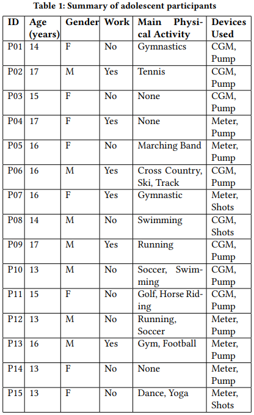
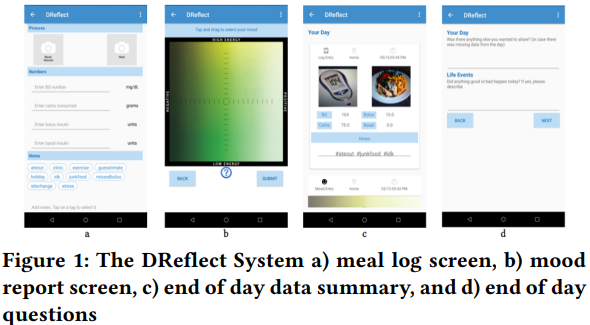

# "My blood sugar is higher on the weekends": Finding a Role for Context and Context-Awareness in the Design of Health Self-Management Technology

https://dl.acm.org/doi/abs/10.1145/3290605.3300349  
Shriti Raj, CHI 2019  

## 0. Abstact

만성 질환의 자가 관리를 위한 도구는 종종 context가 자가 관리 관행에 미치는 영향이 불분명하기 때문에 자가 관리가 발생하는 context에 맞지 않습니다.  
저희는 context가 자가 관리에 어떤 영향을 미치는지 이해하기 위해 15명의 제1형 당뇨병 청소년과 그 보호자를 대상으로 일기 연구를 수행했습니다.  
**당뇨병 자가 관리가 신체 활동, 음식, 감정 상태, 인슐린, 사람 및 태도와 같은 특정 요인에 따라 달라지는 context 프레임이라고 하는 다양한 context 설정을 관찰**했습니다.  
context 프레임 전반에 걸쳐 이러한 요인의 상대적인 보급은 다양한 유형의 지원을 필요로 하는 자가 관리에 영향을 미칩니다.  
저희는 **context 프레임이 현상학적 context 추상화로서 context-인식 시스템의 설계자가 행동 및 기술 지원 행동과의 context 관계를 체계적으로 탐색하고 모델링하는 데 도움이 될 수 있음을 보여줍니다.**  
마지막으로 **context 프레임**을 민감한 개념으로 간주하여 기술 설계에 **context를 사용하기 위한 설계 방향**을 제공합니다.  

## 1. Introduction
만성 건강 상태의 유병률은 증가하는 추세입니다. 2020년까지 1억 5천 7백만 명의 사람들이 적어도 하나의 만성 건강 상태를 가지고 있을 것으로 예상됩니다. 이러한 상태 중 당뇨병(제1형, 제2형 포함)은 사망 원인 7위이며 시력 저하, 신장 기능 장애, 심장 문제와 같은 건강 합병증을 초래할 수 있습니다. 당뇨병과 관련된 위험에도 불구하고, 환자들 사이의 자가 관리 행동을 고수하는 것은 모든 연령대에서 지속되는 문제입니다.  

미국 당뇨병 협회는 당뇨병 예방을 위한 건강한 생활 방식을 장려하기 위한 접근 방식으로 모바일 애플리케이션의 사용을 권장했습니다. 건강 결과를 개선하기 위한 간단한 모바일 건강 개입의 효과는 건강 관련 행동을 안내하기 위한 적시 적응형 개입(JITAI) 및 예측 컴퓨팅과 같은 관리를 지원하기 위한 보다 정교한 접근 방식의 개발을 촉발했습니다. 이러한 접근 방식은 스마트폰에서 감지된 데이터를 context-인식 지원 전달, 즉 적절한 시간, 적절한 장소 및 올바른 방식으로 지원을 제공하는 데 사용합니다.  

context-인식을 활용한 개입이 긍정적인 결과로 이어졌지만, 그러한 시스템을 설계하는 것은 여전히 어려운 과제입니다. 예를 들어, 지원되거나 감소되는 행동과 관련하여 상황적(contextual) 요인의 범위와 관련성을 이해하는 것은 쉽지 않습니다. 즉, 건강관리에 영향을 미칠 수 있고 감지할 수 있는 여러 요소 중 어떤 요소가 관련이 있으며 어떻게 사용해야 할까요?  

시스템에 context를 포함하는 것과 관련된 설계 결정을 지원하기 위해 연구원들은 설계자와 개발자를 위한 context-인식 시스템의 지능을 향상시키기 위해 context의 고수준 추상화의 필요성을 제안했습니다. 기존 추상화는 애플리케이션 및 기능과 관련하여 context를 노출하지만 사용자 행동과 관련하여 context의 역할을 이해하는 데는 도움이 되지 않습니다. 건강 자가 관리 영역에서 특정 행동에 대한 context 기반 조사는 행동에 영향을 미치고 따라서 해당 행동을 지원하는 기술을 설계하는 데 context와 context-인식의 역할을 조명할 수 있습니다.  

이러한 방향으로, 제1형 당뇨병을 앓고 있는 15명의 청소년과 그들의 간병인을 대상으로 3주간의 일기 연구를 수행했습니다. context에 따라 강화된 일기 도구를 통해 수집된 여러 데이터 스트림, 하루 일과 종료 일기 응답, 환자 및 간병인과의 인터뷰 데이터를 사용하여 당뇨병 관리에 대한 살아있는 경험을 조사했습니다. 당뇨병 자가 관리가 다양한 상황적(contextual) 설정(학교, 집, 직장, 여행, 여름, 주말 및 평일)에 따라 다양하다는 것을 관찰했으며, 이러한 차이는 차례로 각 설정 내에서 요인(신체 활동, 음식, 감정 상태, 인슐린, 사람 및 태도)의 관련성과 영향력 변화로 인해 발생했습니다. 이러한 변화를 이해하기 위해 특정 요인이 행동에 영향을 미칠 수 있고 다양한 수준의 관련성을 취할 수 있는 반복적인 높은 수준의 context를 나타내기 위해 **context 프레임의 개념**을 도입합니다. 우리는 context 프레임이 context 요소 모음과 건강 자가 관리 관행의 관계를 묘사하는 데 도움이 되며 이러한 관계를 체계적으로 탐색하고 표현하기 위한 blueprints가 된다는 것을 보여줍니다. 우리는 민감한 개념으로서의 **context 프레임이 설계자가 새로운 설계 방향을 탐색하도록 유도**하여 **context-인식 시스템의 설계 프로세스를 개선**하는 데 설계 지식에 기여한다는 것을 보여줍니다. 건강 자가 관리와 관련하여 상황별(contextual) 프레임이라는 개념에 따라 자가 관리를 지원하기 위해 context 및 context-인식을 사용하는 시스템 설계에 대한 시사점을 지정합니다.  

## 2. Related work

### 2.1. Technology for Diabetes Self-Management
당뇨병은 췌장이 인슐린을 효과적으로 생산하거나 사용할 수 없는 대사 질환으로, 이로 인해 건강한 식사, 활동적인 것, 모니터링, 약물 복용, 문제 해결, 위험 감소, 건강한 대처 등 혈당 (BG) 변화를 제어하기 위해 여러 가지 자가 관리 활동이 필요합니다. 이로 인해 carb 계산, 일기 쓰기 및 성찰과 같은 기능을 제공하는 이러한 활동을 지원하도록 설계된 시스템이 만들어졌습니다. 특히 모바일 애플리케이션의 사용은 다른 개체군의 혈당 조절 개선과 관련이 있습니다.  
그러나 인간-컴퓨터 상호 작용 및 건강 커뮤니티의 연구에 따르면 기존 시스템은 진화하는 환자의 요구, 선호와 일치하지 않으며 사용하기에 부담이 있습니다. 이러한 단점은 당뇨병 자가 관리 관행에 대한 맥락적 이해가 부족하다는 것을 나타내며, 이로 인해 지원이 필요한 맥락에 대한 이해가 부족한 상태에서 권장 사항이나 지원을 제공하는 기술이 발생합니다. 이는 자가 관리 행동에 영향을 미치는 맥락의 역할을 이해해야 함을 의미합니다.  

### 2.2. Influence of Context on Diabetes Management
많은 연구에서 당뇨병 환자와 보호자의 건강 자가 관리 관행이 보고되었습니다. 이러한 연구의 대부분은 환자가 계획, 발견, 정보 제공, 계산 및 기억과 같은 다양한 상황 조건에서 일상 활동을 협상할 필요가 있는 방법을 강조합니다. 그렇게 하기 위해 관련 정보 및 동기 정보 캡처, 행동에 결과를 연관시키는 것, 건강 정보 발견, 지침 개인화 및 당뇨병의 정서적 부담 처리와 같은 관행에 참여했습니다.  
청소년의 경우 돌봄자 참여는 특히 부모와 자녀가 함께 있지 않을 때 자가 모니터링 외에 원격 모니터링이 필요합니다. 이러한 연구는 관행이 맥락에 의해 어떻게 영향을 받는지 강조하지만 맥락 인식 시스템에 대한 설계 고려 사항을 제공하는 데는 초점을 맞추지 않습니다.  
일부 연구가 당뇨병 관리를 지원하기 위해 context를 활용하는 애플리케이션을 개발하는 데 초점을 맞추고 있습니다. **Context의 사용은 주로 context 데이터로 임상 데이터를 보강하여 성찰을 촉진하는 데 제한됩니다. 성찰을 넘어 context는 사용자에게 알림 및 건강 팁 제공, 치료 제안 및 제공자 연락 개시와 같은 다른 서비스를 제공하는 데 사용될 수 있습니다.** 이러한 서비스는 기분 장애 및 척수 손상을 포함한 몇 가지 조건에서 탐구되었지만 이러한 애플리케이션을 설계하는 복잡성은 여전히 연구자들이 직면한 과제입니다. 이는 개인의 직접적인 경험에서 파생되고 시스템 기능으로 변환될 수 있는 context-행동 관계를 어떻게 모델링할 수 있는지 더 잘 이해해야 할 필요성을 나타냅니다.  

### 2.3. Context and Context-Awareness in Health
"context"과 "context 인식"에 대한 많은 분류와 정의가 문헌에 존재하지만, 단일 정의 또는 범주화 체계는 다양한 응용 분야에서 context가 의미하는 바를 수용할 만큼 충분히 포괄적이지 않습니다.  
널리 사용되는 context의 정의는 "사용자와 응용 프로그램 자체를 포함하여 사용자와 응용 프로그램 간의 상호 작용과 관련이 있는 것으로 간주되는 엔티티(즉, 사람, 장소 또는 객체)의 상황을 특성화하는 데 사용할 수 있는 모든 정보"입니다. 시스템은 "관련성이 사용자의 작업에 따라 달라지는 경우 context를 사용하여 사용자에게 관련 정보 및/또는 서비스를 제공"하는 경우 context를 인식한다고 합니다.  

센서가 풍부한 스마트폰의 확산으로 건강한 생활 방식과 만성 건강 상태 관리를 지원하기 위한 상황 인식 모바일 건강 기술을 개발할 수 있게 되었습니다. 문헌에서 탐구된 시스템은 스마트폰에서 감지된 정보, 적시 적응 개입 및 건강 관련 행동 예측을 사용하여 개인화된 알림 및 건강 행동 권장 사항을 제공했습니다.  
이러한 개입은 실제 상황을 인식하고 이에 대응함으로써 진화하고 위치한 사용자 요구를 충족시키는 데 적합합니다. 의료 분야에서 context 사용은 상당한 연구 관심을 받았지만 건강 관련 행동에 대한 context의 역할과 context 인식 애플리케이션을 생성해야 하는 필요를 이해하는 것은 여전히 과제로 남아 있습니다.  

HCI 연구에서는 환자와 연구자가 관련된 실제 경험을 이해하는 데 도움이 되는 성찰을 돕기 위해 상황에 따라 생물 의학 데이터를 표시하는 것이 사용되었습니다. 한 연구에서 이러한 표시는 전문가가 적시 개입에 대한 요구 사항을 이끌어 내기 위해 사용되었습니다.  
유사한 방향으로 당뇨병 관리에 대한 context 중심 조사를 통해 당뇨병 자가 관리 행동에 영향을 미치고 이를 지원하는 시스템을 설계하는 데 있어 context의 역할을 탐구하는 것을 목표로 합니다.  

## 3. Methods
이 연구의 목적은 당뇨병의 자가 관리에 영향을 미치는 context의 역할을 이해하는 것이었습니다. 즉, 다양한 생활 조건과 관련된 문제에서 당뇨병 관리를 이해하는 것입니다. 우리는 이 상태가 여러 잘 알려진 요인 (예: 음식, 인슐린, 운동 및 스트레스)에 의해 영향을 받고 관리를 조정하여 이러한 요인의 변화에 대응해야 하기 때문에 제1형 당뇨병 환자를 연구하기로 결정했습니다. 제1형 당뇨병은 보통 소아기나 청소년기에 시작하여 성인기에 드물게 발병하기 때문에 청소년을 대상으로 연구하기로 결정하였습니다.  

### 3.1. Patient and Caregiver Recruitment
환자와 보호자는 대형 교육 병원의 소아 내분비 클리닉에서 모집했습니다. 우리는 13-17세의 영어를 구사하고 연구 과제를 수행할 의사가 있는 환자를 모집했습니다. 15명의 환자-보호자 아버지가 참여했습니다.  
표 1은 관리에 사용한 장치(연속 포도당 모니터(CGM), 기존 혈당계(Meter) 및 인슐린 펌프(Pump))를 포함한 모든 청소년 참가자에 대한 세부 정보를 제공합니다. 청소년기에는 환자가 질병 관리에 대한 지침을 부모에게 상당히 의존하기 때문에 간병인을 모집하기로 결정했습니다.  

  

### 3.2. Data Collection
데이터 수집에는 초기 인터뷰, 3주간의 일기 연구 및 종료 인터뷰의 세 가지 주요 단계가 있었습니다. 연구를 시작할 때 한 시간 동안의 인터뷰에서 우리는 환자에 대한 인구 통계학적 정보를 수집했습니다. 그런 다음 참가자가 데이터 수집에 사용하는 모바일 애플리케이션인 DReflect(그림 1)의 사용을 시연하고 3주간의 일기 연구에 예상되는 작업을 설명했습니다.  

  

DReflect를 구성하는 일환으로 참가자들은 3주간의 연구 기간 동안 자주 방문할 특정 장소(예: 집, 학교, 직장, 축구 연습 등)와 기상 및 취침 시간을 레이블로 지정하고 저장하도록 요청 받았습니다. 마지막으로 환자와 보호자를 인터뷰하여 환자의 일상 생활과 당뇨병 자가 관리 활동 참여를 이해했습니다.  

일기 연구를 위해 청소년 참가자들이 3주 동안 데이터를 수집하는 데 사용한 **context-enhanced 일기 도구 DReflect를 개발했습니다.** 환자들은 21일 동안 해시태그와 메모를 통해 식사(이미지 및 탄수화물), 혈당(BG) 번호, 인슐린(basal and bolus), 기분, 관리 및 일상 생활에 영향을 미치는 context 요인을 기록하도록 요청 받았습니다.  
하루가 끝날 때마다 모바일 앱을 통해 그날 보고된 데이터의 context 요약을 보여주는 일기를 작성하도록 상기시켰고(그림 1.c), 그날의 중요한 사건(당뇨병 및 비당뇨병 관련), 그날의 당뇨병 관리 문제 및 공유하고 싶거나 하루 중 보고하기를 잊어버릴 수 있는 기타 사항(그림 1.d)을 이해하기 위한 질문이 이어졌습니다. 참가자의 응답에는 BG 번호, 탄수화물, 음식 이미지, 혈당계 이미지, bolus 인슐린 및 메모가 포함되었습니다.  

저희는 또한 **간병인들에게 21일 동안 일기장을 작성하도록 요청**했습니다. 간병인들은 자신의 하루, 가족의 일상, 하루 중에 있었던 특이한 일들과 자녀의 하루, 그리고 그날의 당뇨병 관리의 어려움에 대해 보고하도록 요청 받았습니다. 간병인들은 첫 번째 인터뷰에서 선택한 시간에 매일 온라인 질문지에 대한 링크를 이메일로 받았습니다.  
대부분의 간병인은 21일 내내 일기를 작성했다고 보고했습니다. 연구 후 환자와 간병인을 별도로 1시간 동안 출구 인터뷰를 진행했습니다. 인터뷰 중에는 먼저 참가자에게 되짚어 생각하며 데이터의 요약 시각화를 거닐도록 요청했습니다.  
다음으로, 우리는 **그들에게 특이하거나 일기장 데이터에서 확인된 중요한 사건과 관련된 날에 초점을 맞춘 질문을 했습니다.** 이 질문들은 회상과 반성적 대화를 가능하게 하기 위해 그들의 데이터를 매일 표시하는 것으로 보충되었습니다. 인터뷰 전에 시각화와 질문으로 구성된 출구 인터뷰 문서가 참가자들에게 보내졌습니다.  
상황별 데이터와 함께 결과 측정에 대한 성찰은 자신의 행동에 대한 더 많은 인식을 만들어내는 것으로 나타났습니다. 참가자들의 반응은 당뇨병 관리에 대한 통찰력과 **당뇨병 관리에 대한 실제 경험을 얻기 위해 데이터를 어떻게 사용했는지 이해**하는 데 도움이 되었습니다. 이 논문에서는 context가 당뇨병 자가 관리에 어떻게 영향을 미치는지에 대한 이해를 제공하기 위해 후자에 대해 보고합니다.  

### 3.3.Data Analysis
우리는 두 단계로 데이터를 분석했습니다. 일기장 연구 후, 일기장 기입과 초기 인터뷰를 분석하여 각 참가자의 관리 상황과 어렵거나 비정형적인 상황을 이해했습니다. 이러한 통찰력은 환자의 데이터 표시와 연구 중에 발생한 사건에 대한 질문으로 구성된 출구 인터뷰 문서를 준비하는 데 사용되었습니다.  
연구가 끝나면 초기 인터뷰와 퇴장 인터뷰를 생체 내 코딩과 서술적 코딩을 통해 재분석하여 자기관리를 위한 다양한 설정과 관리에 영향을 미치는 요인을 이해했습니다. 연구팀은 데이터 분석 과정에서 여러 번 만나 요인과 설정 목록을 반복적으로 정제하고 이 주제들을 더욱 정교화하는 동시에 덜 중요한 주제는 삭제했습니다.  

## 4. Findings
당뇨병 자가 관리에 대한 맥락의 영향을 이해하는 데 있어, 우리는 _여러 요인(신체 활동, 음식 등)이 자가 관리에 영향을 미치기 위해 수렴하는 반복적인 contextual 환경(가정, 학교 등)_ 에서 자가 관리가 발생한다는 것을 관찰했습니다.  
우리는 또한 이러한 요인들이 참가자들이 설명한 바와 같이 다양한 contextual 설정에서 다른 영향을 미친다는 것을 관찰했습니다. 이전 연구에서도 당뇨병 관리에 있어 context의 영향을 지적하기 때문에 이러한 관찰은 분명해 보일 수 있지만, context-behavior 관계를 모델링하고 상황 인식 시스템의 설계에 알리기 위해 환자의 살아있는 경험을 체계적으로 포착할 수 있는 방법에 대한 탐색과 설명은 제한적입니다.  

**건강 자가 관리 행동에 대한 context의 영향을 더 잘 설명하기 위해 참가자의 살아있는 경험에 의해 정보를 얻은 context 프레임의 개념을 소개합니다.** 저희는 **context 프레임을 특정 행동 선택을 억제하고 다른 사람을 용이하게 함으로써 해당 프레임에 거주하는 개인의 행동을 크게 형성하는 반복되는 물리적, 시간적 및/또는 사회적 context로 정의**합니다.  
중요한 것은 서로 다른 contextual 프레임 내에서 context를 특성화하고 결과를 예측하거나 행동에 영향을 미치기 위해 도출할 수 있는 특정 요인(즉, 사람, 환경 및 시스템의 관찰 가능한 상태)은 서로 다른 관련성 정도와 관심 있는 상황, 결과 및 행동에 대한 서로 다른 관계를 취하면서 서로 다르게 작동할 수 있습니다.  

참가자의 살아있는 경험에서 나타난 다양한 **context 프레임에는 집, 학교, 직장, 여행, 여름, 주말 및 평일이 포함**됩니다. **프레임 간에 서로 다른 정도로 관련이 있는 것으로 밝혀진 요인에는 위치, 시간, 신체 활동, 음식, 감정 상태, 인슐린, 사람 및 태도가 포함**됩니다. 프레임은 요인의 모음이며 사용자에게 더 안정적일 가능성이 높고 예측 가능한 요인에 단단히 묶여 있을 수 있습니다. 데이터에서 참가자가 사용한 대부분의 설명은 물리적, 시간적 또는 사회적 환경을 중심으로 이루어졌습니다. 이로 인해 이름에 반영된 대로 **이러한 요인에 묶인 프레임**을 만들었습니다. 물리적, 시간적 및 사회적 맥락 외에 프레임은 **사용자가 고정 활동(예: 주중 근력 훈련 및 주말 달리기)을 수행하는 경우 신체 활동과 같은 다른 안정적인 요인에 바인딩**될 수 있습니다. 프레임이 감정 상태와 같이 자주 변경되는 요인에 속할 수 있는 경우 결과는 서로 크게 다르지 않을 수 있는 여러 프레임이 될 수 있습니다.

다음에서는 참가자의 경험에 대한 설명에서 contextual 프레임이 어떻게 나타나는지 보여주는 비네트(Vignette)를 제시합니다. 특정 요인의 역할과 이러한 역할이 다른 contextual 프레임에서 어떻게 변화했는지 추가로 설명합니다.

### 세 가지 시나리오

1. 당뇨병이 관리된 다양한 설정
2. 다양한 설정에서 관리에 영향을 미치는 요인 
3. 이러한 설정 간의 자가 관리 변화를 설명하는 참가자의 당뇨병 자가 관리

위에 항목들에 대한 설명에서 파생된 세 가지 시나리오를 제시합니다.  

- 사례 1: 가정, 학교, 직장 간의 전환.
    - 닉(Nick)의 이야기:
        - **상황**: 16세 고등학생 닉은 학교에 다니고 아이스크림 가게에서 일합니다.
        - **일상**: 아침 6시에 일어나 준비하고 학교에 갑니다. 점심은 학교 식당에서 매일 같은 음식을 먹고, 인슐린 양도 고정되어 있습니다. 학교 수업 후 집에 돌아와 여러 활동을 하고, 오후 6시에 저녁을 먹지 않고 직장으로 갑니다.
        - **관리 문제**: 직장에서 일하는 동안 저혈당을 방지하기 위해 주스를 가지고 다닙니다. 밤 10시에 집에 돌아와 혼자 저녁을 먹습니다. 늦은 저녁 식사로 인해 밤과 다음날 아침에 고혈당을 경험하게 되어 관리가 어려워집니다. 주말에는 저녁을 일찍 먹고 혈당 관리가 더 잘 됩니다.
- 사례 2: 여름과 학교, 주중과 주말 사이의 전환.
    - 비올라(Viola)의 이야기:
        - **상황**: 14세 중학생 비올라는 여름 방학 후 새로운 학기를 시작했습니다.
        - **여름 방학 동안**: 집에서 주로 시간을 보내거나 부모님과 여행을 하며 혈당 관리가 잘 되었습니다.
        - **학교 시작 후**: 정해진 일정 덕분에 자기 관리 활동을 잘 기억하지만, 식사량을 잘못 계산하거나 식사를 끝내지 못해 학교에서 혈당 조절이 어렵습니다. 요가와 춤 수업이 있는 날은 혈당 수치에 더 큰 영향을 미칩니다. 주말에는 부모의 도움으로 관리가 더 잘 됩니다.
- 사례 3: 여름캠프, 근무일, 주말, 평일 간 전환.
    - 케빈(Kevin)의 이야기:
        - **상황**: 17세 고등학생 케빈은 여름 동안 당뇨병 캠프에 또래 코치로 참여했습니다.
        - **캠프 기간**: 코치 역할로 인해 당뇨병 관리 시간이 부족했고, 캠프 음식 때문에 탄수화물 계산이 어려웠습니다. 활동량이 많아 저혈당이 자주 발생했고, 인슐린 펌프를 자주 중지했습니다.
        - **캠프 후**: 피자 가게에서 일하게 되면서 혈당이 안정적으로 유지되었습니다. 직장에서의 지속적인 활동과 집에서의 간식 섭취 감소 덕분이었습니다.
        - **주말**: 친구들과 비디오 게임을 하며 시간을 보내는 동안 당뇨병 관리를 소홀히 하게 되어 혈당 수치가 불안정해졌습니다.

#### 각 사례 요약
- **사례 1**: 닉은 학교와 직장 간의 일과 시간 변화로 인해 혈당 관리에 어려움을 겪고 있습니다. 특히 직장에서 늦은 저녁 식사가 큰 문제가 됩니다.

- **사례 2**: 비올라는 여름 방학 동안과 학교 기간 동안의 일과가 달라짐에 따라 혈당 관리에 도전이 생깁니다. 특히 학교에서의 일정과 활동이 큰 영향을 미칩니다.

- **사례 3**: 케빈은 여름 캠프, 직장, 주말 동안의 활동과 식사 습관 변화로 인해 혈당 관리에 어려움을 겪고 있습니다. 특히 캠프와 주말 동안의 활동량 변화가 큰 영향을 미칩니다.