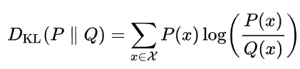
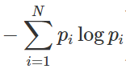
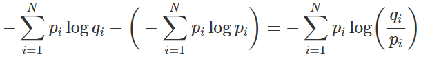

# Generalization bounds에 대해 이해하기 위한 내용 정리

## PAC Beyesian Generalization Bound

## KL divergence
~~~
참고 자료
https://hwiyong.tistory.com/408
~~~

KLD(이하 KL-Divergence)는 P 분포와 Q 분포가 얼마나 다른지를 측정하는 방법.  
여기서 통계적으로 P는 사후, Q는 사전분포를 의미함.  

텐서플로우 공식 문서에 정의되어있는 용어로 설명해보면, KLD는 y_true(P)가 가지는 분포값과 y_pred(Q)가 가지는 분포값이 얼마나 다른지를 확인하는 방법.

KLD는 값이 낮을수록 두 분포가 유사하다라고 해석함.  
정보이론에서 흔히 볼 수 있는 엔트로피(Entropy) 또한, 값이 낮을수록 랜덤성이 낮다고 해석하는 것과 비슷함.  
두 가지의 해석 방법이 비슷한 것은 바로 KLD에 크로스-엔트로피(Cross-Entropy) 개념이 이미 포함되어 있기 때문임.  

### KLD와 Cross Entropy 관계

정보이론에서 정보량은 다음을 효과적으로 표현하기 위해 로그를 사용하여 표현함.

확률이 높을수록 → 매우 당연하게 일어날 사건
확률이 낮으면 → 자주 일어나지 않는 특별한 사건

우리가 아는 엔트로피는 평균 정보량을 나타내므로 아래와 같이 표현됨.

KLD와 어떤 관련성이 있을까?  

아래와 같이 생각해보자.  
~~~
p : 실제 세계에서 관찰하여 얻어낸 확률 ; 실제 확률분포 P
q : 모델이 예측한 확률 ; 확률분포 P로 근사될 분포 Q
~~~

앞에서 소개했던 KLD 식을 다시 생각해보면 log의 성질에 의해 왼쪽의 항처럼 분해하여 생각할 수 있음.  

이는 아래와 같이 해석됨.  
~~~
KL-Divergence = Cross-Entropy - Entropy
~~~

